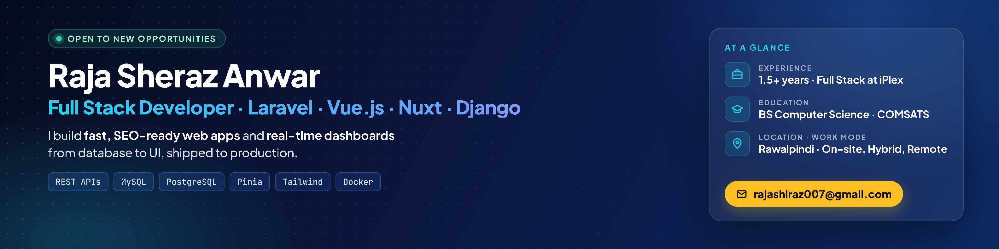
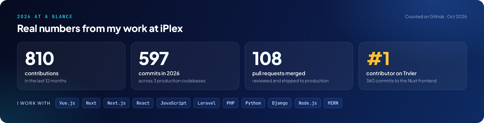

  

  

  
  
  
  

## About me

- 💼 **Full Stack Developer at iPlex** (Lucid Web Solutions), Rawalpindi, since Feb 2026
- 🐍 Before that, **Backend Developer at Ezitech** (Python, Django, DRF, PostgreSQL), Jan to Nov 2025
- 🎓 **BS Computer Science**, COMSATS University Islamabad (2020 to 2024)
- 📍 Rawalpindi, Pakistan · open to on-site, hybrid and remote roles

## What I'm great at

| | |
|---|---|
| ⚡ **Performance optimization** | Core Web Vitals, WebP image pipelines, LCP and CLS fixes, response caching, removing N+1 queries, database indexing |
| 🧪 **Testing and quality** | PHPUnit, Vitest and Playwright tests, Lighthouse audits, code reviews, debugging production issues |
| 🤖 **AI-assisted development** | I ship faster with Claude Code and Cursor in my daily workflow; ML and data analysis foundations (Google Advanced Data Analytics) |
| 🔍 **Technical SEO** | Server-side rendering, canonical URLs, JSON-LD structured data, sitemaps, Open Graph |
| 🔴 **Real-time apps** | Live dashboards with Laravel Echo and Pusher, role-based permissions with CASL |

## What I'm building at work

| Project | What it is | Stack |
|---|---|---|
| **[Trvler](https://trvler.co)** | Live travel discovery platform for destinations, hotels, restaurants, attractions and travel stories. I build the server-rendered Nuxt frontend (technical SEO, Core Web Vitals) and the Laravel REST API and admin panel. | Nuxt 4 · Vue 3 · TypeScript · Laravel · MySQL |
| **Coach** | Real-time, tablet-first American football coaching dashboard. Head, assistant and scoreboard coaches share live play calls, scores, the game clock and substitutions. | Vue 3 · Pinia · Laravel Echo · Pusher · CASL |

Both are client projects in private repositories, so the code isn't public. My commits to them are counted in the contribution graph below.

## Featured projects

| Project | Description | Stack |
|---|---|---|
| [ProjectFlow (Nuxt)](https://github.com/Raja-Sheraz/projectflow-nuxt) | Task and team management app with a drag-and-drop Kanban board, admin/member roles and protected routes, plus full technical SEO (SSR, canonical URLs, JSON-LD, sitemap). | Nuxt 4 · Vue 3 · Pinia · TypeScript · Tailwind |
| [PGMS: Final Year Project](https://github.com/Raja-Sheraz/Raja-Sheraz-PGMS-Paperless-Graduate-Management-System-e-in-MERN-) | Paperless graduate management system: online thesis and proposal submission, multi-level approvals (Supervisor → Committee → DAC → Dean) and PDF reports. | MongoDB · Express · React · Node.js · MUI |
| [Fiverr Clone](https://github.com/Raja-Sheraz/Fiver-CLone) | Freelance marketplace with JWT login, gig listings, search and filters, and orders. | MERN · JWT |
| [Town Management App](https://github.com/Raja-Sheraz/Town-Management-in-React-Native-Mobile-App) | Mobile app for properties, announcements, events and complaints, with offline SQLite storage. | React Native · SQLite |

## Tech stack

  

## 2026 at a glance

  

  

  <picture>
    <source media="(prefers-color-scheme: dark)" srcset="https://raw.githubusercontent.com/Raja-Sheraz/Raja-Sheraz/output/github-snake-dark.svg">
    
  </picture>

## Certifications

Meta Django Web Framework · Google Advanced Data Analytics · Google Business Intelligence · Google Project Management · DSA with Java (Apna College)

---

📫 The fastest way to reach me is <a href="mailto:rajashiraz007@gmail.com">rajashiraz007@gmail.com</a> or <a href="https://www.linkedin.com/in/raja-sheraz-anwar-568140233">LinkedIn</a>.

